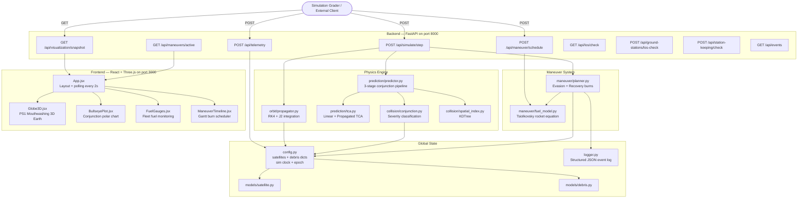
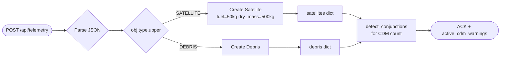
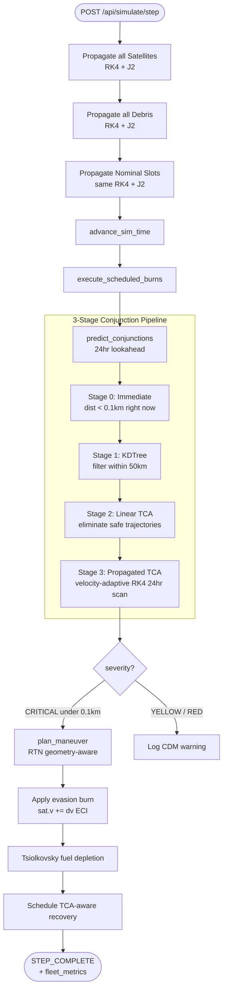
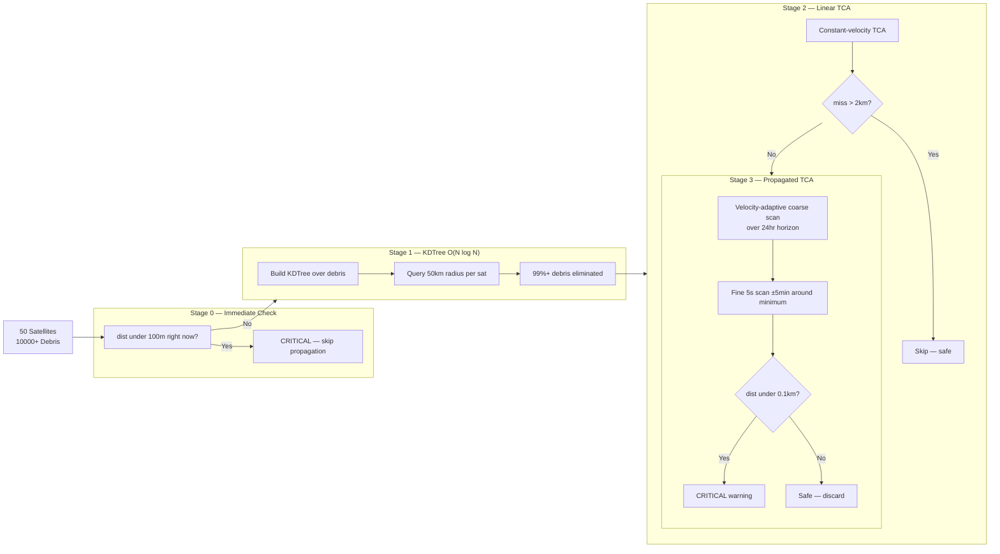
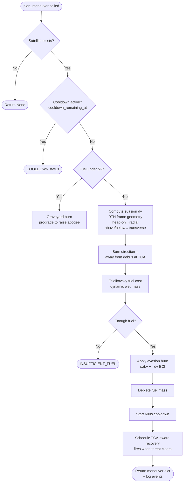
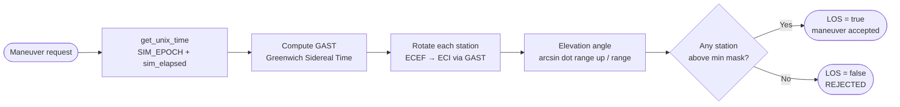
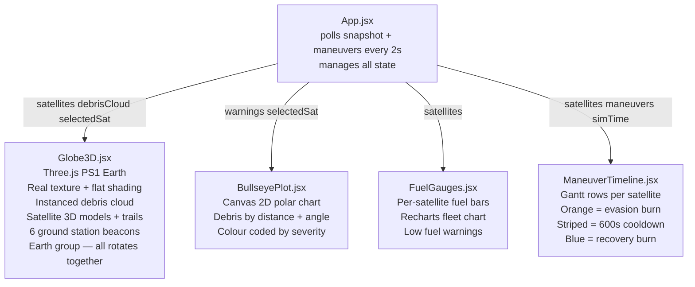
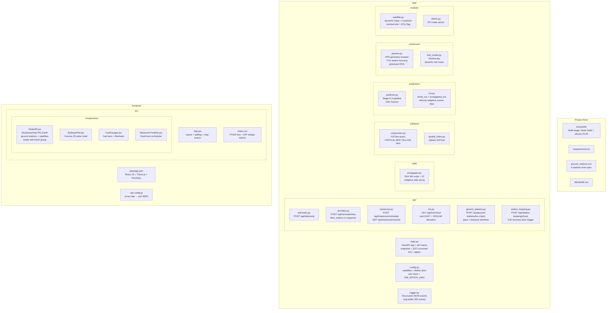

# ◈ SOLIS
### National Space Hackathon 2026 — Project SOLIS-1

> A high-performance backend system and real-time 3D dashboard for autonomous satellite collision avoidance, maneuver planning, and constellation management in Low Earth Orbit.

---


---

## Overview

SOLIS is a ground-based autonomous system acting as the "brain" for a fleet of 50+ active satellites navigating a hazardous debris field in LEO. It continuously ingests orbital telemetry, predicts conjunctions up to 24 hours ahead, and autonomously plans and executes collision avoidance maneuvers — all without human intervention.

---

## System Architecture — High Level



---

## Request Flow — Telemetry Ingestion



---

## Request Flow — Simulate Step



---

## Conjunction Detection Pipeline



---

## Maneuver Planning Flow



---

## Fuel Model

```mermaid
flowchart LR
    A[delta_v km/s] --> B[Convert to m/s]
    B --> C[dm = m_current × 1 − exp(−dv / Isp×g0)]
    C --> D[sat.fuel -= dm\nsat.mass decreases]
    D --> E{fuel fraction\nunder 5%?}
    E -->|Yes| F[EOL_TRIGGERED\nschedule graveyard burn]
    E -->|No| G[Continue ops]

    subgraph K["Constants"]
        H[Isp = 300s · g0 = 9.80665 m/s²\nMax dv = 15 m/s · Cooldown = 600s]
    end
```

---

## Ground Station LOS



---

## Frontend Component Tree



---

## File Reference



---

## Physics Reference

### RK4 + J2 Propagation

```
d²r/dt² = -(μ/|r|³)r + a_J2

a_J2x = (3/2) × J2 × μ × R_E² / |r|⁵ × x × (5(z/|r|)² - 1)
a_J2y = (3/2) × J2 × μ × R_E² / |r|⁵ × y × (5(z/|r|)² - 1)
a_J2z = (3/2) × J2 × μ × R_E² / |r|⁵ × z × (5(z/|r|)² - 3)

μ = 398600.4418 km³/s²    R_E = 6378.137 km    J2 = 1.08263×10⁻³
```

### Tsiolkovsky Rocket Equation

```
Δm = m_current × (1 - e^(-|Δv| / (Isp × g₀)))

Isp = 300s    g₀ = 9.80665 m/s²
```

### Spacecraft Constants

| Parameter | Value |
|---|---|
| Dry mass | 500.0 kg |
| Initial fuel | 50.0 kg |
| Max Δv per burn | 15.0 m/s |
| Thruster cooldown | 600 s |
| EOL fuel threshold | 5% (2.5 kg) |
| Collision radius | 100 m (0.1 km) |
| Station-keeping box | 10 km radius |
| Signal latency | 10 s |

---

## API Reference

### `POST /api/telemetry`
```json
{
  "timestamp": "2026-03-12T08:00:00.000Z",
  "objects": [
    {
      "id": "SAT-001",
      "type": "SATELLITE",
      "r": { "x": 6778.0, "y": 0.0, "z": 0.0 },
      "v": { "x": 0.0, "y": 7.669, "z": 0.0 }
    }
  ]
}
```

### `POST /api/simulate/step`
```json
{ "step_seconds": 60 }
```

Response includes `fleet_metrics`:
```json
{
  "status": "STEP_COMPLETE",
  "collisions_detected": 3,
  "maneuvers_executed": 3,
  "fleet_metrics": {
    "uptime_pct": 94.0,
    "total_fuel_used_kg": 1.834,
    "optimization_ratio": 51.2,
    "sats_in_slot": 47,
    "sats_total": 50
  }
}
```

### `POST /api/maneuver/schedule`
```json
{
  "satelliteId": "SAT-001",
  "maneuver_sequence": [
    {
      "burn_id": "EVASION_BURN_1",
      "burnTime": "2026-03-12T14:15:30.000Z",
      "deltaV_vector": { "x": 0.002, "y": 0.010, "z": -0.001 }
    }
  ]
}
```

Validated against: satellite existence · Δv ≤ 15 m/s · 600 s cooldown · sufficient fuel · ground station LOS

### `GET /api/visualization/snapshot`
Compressed fleet state. Debris returned as flattened tuples `[ID, lat, lon, alt]` for minimal payload size.

### `GET /api/maneuvers/active`
All pending burns across the constellation with type, execute_at, and status.

### `GET /api/los/check?x=6778&y=0&z=0`
Per-station elevation angles computed using GAST at simulation epoch.

### `GET /api/events`
Last 500 structured events: `CDM_DETECTED`, `MANEUVER_PLANNED`, `MANEUVER_EXECUTED`, `RECOVERY_SCHEDULED`, `RECOVERY_EXECUTED`, `EOL_TRIGGERED`, `GRAVEYARD_EXECUTED`.

---

## Evaluation Criteria

| Criteria | Weight | How We Address It |
|---|---|---|
| **Safety Score** | 25% | 4-stage pipeline (Stage 0 + KDTree + Linear TCA + Propagated TCA); geometry-aware RTN evasion; real LOS validation |
| **Fuel Efficiency** | 20% | RTN axis selection picks cheapest burn per geometry; dynamic Tsiolkovsky wet mass; slot-targeted recovery |
| **Constellation Uptime** | 15% | Nominal slot propagated with same RK4+J2; TCA-aware recovery only fires when threat clears; 10 km box monitoring |
| **Algorithmic Speed** | 15% | KDTree O(N log N); adaptive step sizing; velocity-adaptive TCA coarse step; 500 ms snapshot TTL cache |
| **UI/UX & Visualization** | 15% | PS1 Mouthwashing globe; pulsing ground station beacons; satellites rotate with Earth; Gantt timeline; Bullseye plot |
| **Code Quality** | 10% | Structured JSON event logging (7 event types); typed Pydantic models; modular architecture; full stress test suite |

---

## Quick Start

### Docker
```bash
docker build -t acm .
docker run -p 8000:8000 acm
# Full stack at http://localhost:8000
```

### Local Development

**Backend** (run from project root, not inside `app/`):
```bash
pip install -r requirements.txt
python -m uvicorn app.main:app --reload --host 0.0.0.0 --port 8000
```

**Frontend:**
```bash
cd frontend
npm install
npm run dev -- --host 0.0.0.0
# Open http://localhost:3000
```

### Stress Test
```bash
python app/stress_test.py
```

---

## Project Structure

```
acm-project/
├── app/
│   ├── main.py                  # FastAPI entry point, all routers, snapshot
│   ├── config.py                # Global state, sim clock, SIM_EPOCH_UNIX
│   ├── logger.py                # Structured JSON event log (ring buffer)
│   ├── stress_test.py           # Automated test suite
│   ├── api/
│   │   ├── telemetry.py         # POST /api/telemetry
│   │   ├── simulate.py          # POST /api/simulate/step
│   │   ├── maneuver.py          # POST /api/maneuver/schedule + active
│   │   ├── los.py               # GET /api/los/check (real LOS geometry)
│   │   ├── ground_stations.py   # Pass windows + blackout calculator
│   │   └── station_keeping.py   # 10 km box monitor + CW recovery burns
│   ├── orbit/
│   │   └── propagator.py        # RK4 + J2, adaptive step sizing
│   ├── collision/
│   │   ├── conjunction.py       # KDTree query, severity tiers
│   │   └── spatial_index.py     # sklearn KDTree wrapper
│   ├── prediction/
│   │   ├── predictor.py         # Stage 0–3 pipeline
│   │   └── tca.py               # linear_tca + propagated_tca
│   ├── maneuver/
│   │   ├── planner.py           # RTN evasion, TCA-aware recovery, EOL
│   │   └── fuel_model.py        # Tsiolkovsky + max_delta_v
│   └── models/
│       ├── satellite.py         # Dynamic mass, cooldown, nominal slot
│       └── debris.py            # ECI state vector
├── frontend/
│   ├── src/
│   │   ├── App.jsx              # Layout, polling, step button
│   │   ├── index.css            # VT323 font, CRT design system
│   │   └── components/
│   │       ├── Globe3D.jsx      # Three.js PS1 globe + ground stations
│   │       ├── BullseyePlot.jsx # Polar conjunction chart
│   │       ├── FuelGauges.jsx   # Fleet fuel monitoring
│   │       └── ManeuverTimeline.jsx  # Gantt burn scheduler
│   ├── index.html
│   ├── package.json
│   └── vite.config.js
├── Dockerfile                   # Multi-stage: Node build → ubuntu:22.04
├── requirements.txt
├── ground_stations.csv
└── README.md
```

---

## Team Solis

Built for the **National Space Hackathon 2026 — Project AETHER**.
