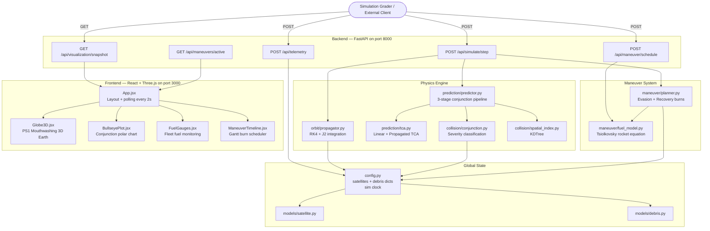
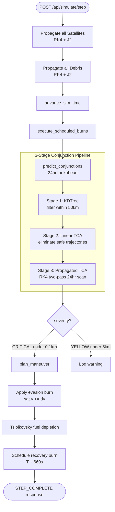
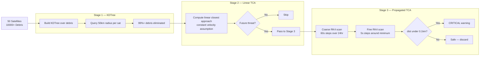
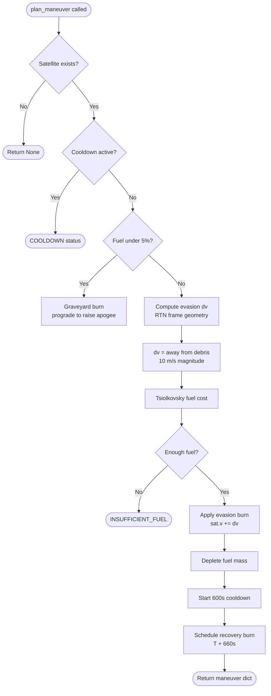
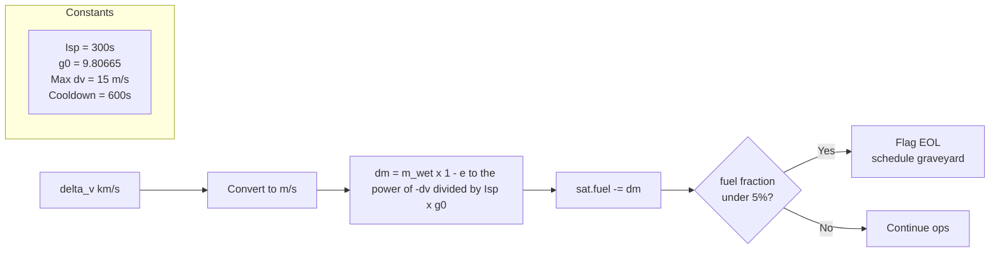
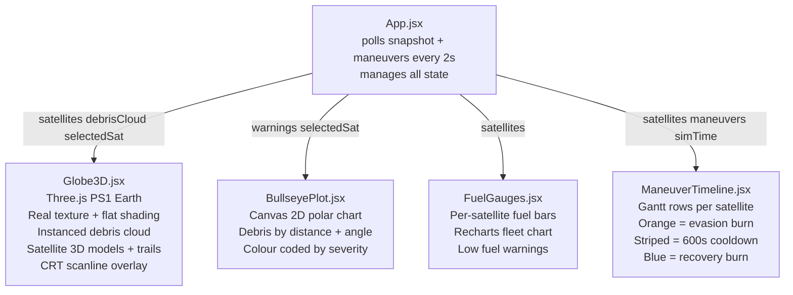
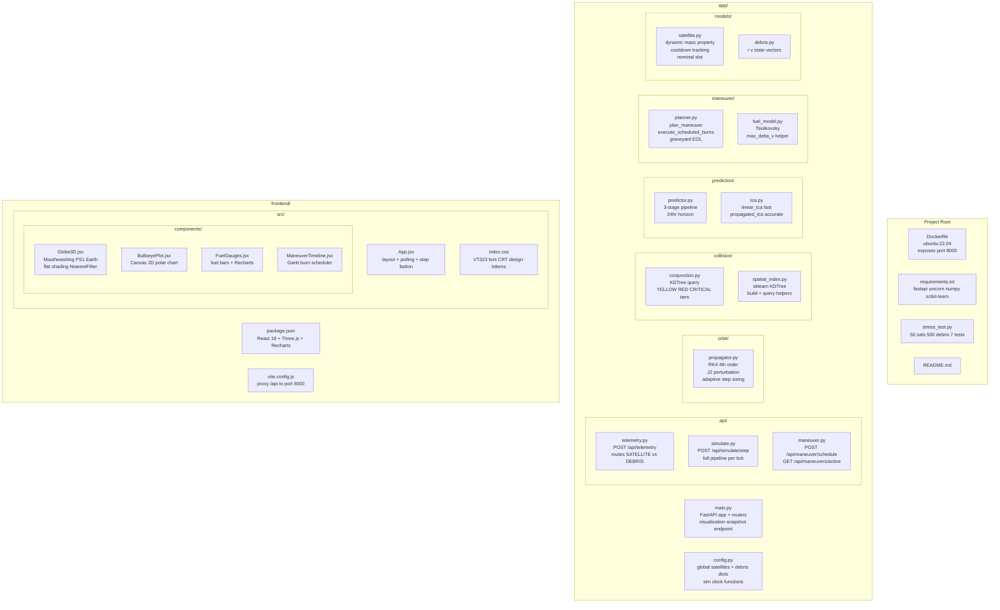

# ◈ Autonomous Constellation Manager (ACM)
### National Space Hackathon 2026 — Project SOLIS

> A high-performance backend system and real-time 3D dashboard for autonomous satellite collision avoidance, maneuver planning, and constellation management in Low Earth Orbit.

---


---

## Overview

The ACM is a ground-based autonomous system acting as the "brain" for a fleet of 50+ active satellites navigating a hazardous debris field in LEO. It continuously ingests orbital telemetry, predicts conjunctions up to 24 hours ahead, and autonomously plans and executes collision avoidance maneuvers — all without human intervention.

---

## System Architecture — High Level



---

## Request Flow — Telemetry Ingestion


---

## Request Flow — Simulate Step



---

## Conjunction Detection Pipeline



---

## Maneuver Planning Flow



---

## Fuel Model



---

## Frontend Component Tree



---

## File Reference



---

## Physics Reference

### RK4 + J2 Propagation

```
d²r/dt² = -(μ/|r|³)r + a_J2

a_J2x = (3/2) × J2 × μ × R_E² / |r|⁵ × x × (5(z/|r|)² - 1)
a_J2y = (3/2) × J2 × μ × R_E² / |r|⁵ × y × (5(z/|r|)² - 1)
a_J2z = (3/2) × J2 × μ × R_E² / |r|⁵ × z × (5(z/|r|)² - 3)

μ = 398600.4418 km³/s²    R_E = 6378.137 km    J2 = 1.08263×10⁻³
```

### Tsiolkovsky Rocket Equation

```
Δm = m_current × (1 - e^(-|Δv| / (Isp × g₀)))

Isp = 300s    g₀ = 9.80665 m/s²
```

### Spacecraft Constants

| Parameter | Value |
|---|---|
| Dry mass | 500.0 kg |
| Initial fuel | 50.0 kg |
| Max Δv per burn | 15.0 m/s |
| Thruster cooldown | 600 s |
| EOL fuel threshold | 5% |
| Collision radius | 100 m (0.1 km) |
| Station-keeping box | 10 km radius |

---

## API Reference

### `POST /api/telemetry`
```json
{
  "timestamp": "2026-03-12T08:00:00.000Z",
  "objects": [
    {
      "id": "SAT-001",
      "type": "SATELLITE",
      "r": { "x": 6778.0, "y": 0.0, "z": 0.0 },
      "v": { "x": 0.0, "y": 7.669, "z": 0.0 }
    }
  ]
}
```

### `POST /api/simulate/step`
```json
{ "step_seconds": 60 }
```

### `POST /api/maneuver/schedule`
```json
{
  "satelliteId": "SAT-001",
  "maneuver_sequence": [
    {
      "burn_id": "EVASION_BURN_1",
      "burnTime": "2026-03-12T14:15:30.000Z",
      "deltaV_vector": { "x": 0.002, "y": 0.010, "z": -0.001 }
    }
  ]
}
```

### `GET /api/visualization/snapshot`
Compressed fleet snapshot for 3D frontend rendering.

### `GET /api/maneuvers/active`
All pending scheduled burns across the constellation.

---

## Quick Start

### Docker
```bash
docker build -t acm .
docker run -p 8000:8000 acm
```

### Local Development

**Backend:**
```bash
pip install -r requirements.txt
uvicorn app.main:app --reload --port 8000
```

**Frontend:**
```bash
cd frontend
npm install
npm run dev
# Open http://localhost:3000
```

### Stress Test
```bash
pip install requests
python stress_test.py
```

---

## Evaluation Criteria

| Criteria | Weight | Implementation |
|---|---|---|
| Safety Score | 25% | 3-stage conjunction pipeline, autonomous evasion |
| Fuel Efficiency | 20% | RTN-frame burns, Tsiolkovsky mass tracking |
| Constellation Uptime | 15% | Station-keeping box, recovery burns |
| Algorithmic Speed | 15% | KDTree O(N log N), adaptive RK4 step sizing |
| UI/UX & Visualization | 15% | PS1 Mouthwashing-style 3D globe, real-time panels |
| Code Quality | 10% | Modular architecture, typed models, logging |

---

## Team Solis

Built for the **National Space Hackathon 2026**.
## Project Structure

```
ACM PROJECT
├── app/
│   ├── __pycache__/
│   ├── api/
│   │   ├── __pycache__/
│   │   ├── maneuver.py
│   │   ├── simulate.py
│   │   └── telemetry.py
│   ├── collision/
│   │   ├── __pycache__/
│   │   ├── conjunction.py
│   │   └── spatial_index.py
│   ├── maneuver/
│   │   ├── __pycache__/
│   │   ├── fuel_model.py
│   │   └── planner.py
│   ├── models/
│   │   ├── __pycache__/
│   │   ├── debris.py
│   │   └── satellite.py
│   ├── orbit/
│   │   ├── __pycache__/
│   │   └── propagator.py
│   ├── physics/
│   │   └── __pycache__/
│   │       └── propagator.cpython-314.pyc
│   ├── prediction/
│   │   ├── __pycache__/
│   │   ├── predictor.py
│   │   └── tca.py
│   ├── config.py
│   ├── main.py
│   └── stress_test.py
│
├── frontend/
│   ├── node_modules/
│   └── src/
│       ├── components/
│       │   ├── BullseyePlot.jsx
│       │   ├── FuelGauges.jsx
│       │   ├── Globe3D.jsx
│       │   └── ManeuverTimeline.jsx
│       ├── App.jsx
│       ├── index.css
│       └── main.jsx
│   ├── index.html
│   ├── package-lock.json
│   ├── package.json
│   └── vite.config.js
│
├── dockerfile
├── README.md
└── requirements.txt
```
## 📁 Project Structure (Explained)

```
ACM PROJECT
```

### 🔧 Backend (`app/`)
Core logic for simulation, prediction, and maneuver planning.

- **api/** → Handles API endpoints (routes)
  - `simulate.py` → Runs simulation steps
  - `maneuver.py` → Handles maneuver-related requests
  - `telemetry.py` → Satellite data / telemetry APIs  

- **collision/** → Collision detection system  
  - `conjunction.py` → Detects close approaches between objects  
  - `spatial_index.py` → Optimized spatial searching  

- **maneuver/** → Maneuver planning logic  
  - `planner.py` → Decides how to avoid collisions  
  - `fuel_model.py` → Calculates fuel usage  

- **models/** → Data structures  
  - `satellite.py` → Satellite model  
  - `debris.py` → Space debris model  

- **orbit/** → Orbital mechanics  
  - `propagator.py` → Updates satellite position over time  

- **prediction/** → Future risk analysis  
  - `predictor.py` → Predicts possible collisions  
  - `tca.py` → Time of Closest Approach calculations  

- `config.py` → Configuration (constants, parameters)  
- `main.py` → Entry point (starts backend server)  
- `stress_test.py` → Performance testing  

---

### 🌐 Frontend (`frontend/`)
User interface built with React + Vite.

- **src/components/** → UI components  
  - `Globe3D.jsx` → 3D Earth visualization  
  - `BullseyePlot.jsx` → Collision visualization  
  - `FuelGauges.jsx` → Fuel usage display  
  - `ManeuverTimeline.jsx` → Timeline of maneuvers  

- `App.jsx` → Main app component  
- `main.jsx` → React entry point  
- `index.css` → Styling  

- `index.html` → Root HTML file  
- `package.json` → Project dependencies  
- `vite.config.js` → Vite configuration  

---

### ⚙️ Other Files

- `dockerfile` → Container setup  
- `requirements.txt` → Python dependencies  
- `README.md` → Project documentation  

---

### 💡 Summary
This project simulates **satellite collision detection and avoidance**, combining:
- Orbital physics  
- Collision prediction  
- Maneuver planning  
- Interactive 3D visualization  
### CONTEXT.md
-------------------------------------------------------------------------------------------------------------------------------------------------
# ACM Project — CONTEXT.md
> Read this file first. It gives a complete picture of the codebase so you can jump in without asking basic questions.

---

## What This Project Is

An **Autonomous Constellation Manager (ACM)** built for the National Space Hackathon 2026. It is a full-stack system that:

1. Ingests real-time orbital telemetry (position + velocity) for satellites and debris
2. Predicts collisions up to 24 hours ahead using a 3-stage spatial filtering pipeline
3. Autonomously plans and executes evasion + recovery maneuvers
4. Renders everything on a PS1/Mouthwashing-style 3D globe dashboard

**Stack:** Python 3.14 + FastAPI backend, React 18 + Three.js frontend, Docker for deployment.

---

## Project Structure

```
ACM PROJECT/
├── app/                        # All backend Python code
│   ├── main.py                 # FastAPI app entry point — registers all routers + snapshot endpoint
│   ├── config.py               # Global state: satellites dict, debris dict, sim clock
│   ├── api/
│   │   ├── telemetry.py        # POST /api/telemetry — ingests objects into global state
│   │   ├── simulate.py         # POST /api/simulate/step — runs full physics tick
│   │   └── maneuver.py         # POST /api/maneuver/schedule + GET /api/maneuvers/active
│   ├── orbit/
│   │   └── propagator.py       # RK4 integrator + J2 perturbation — the physics core
│   ├── collision/
│   │   ├── conjunction.py      # KDTree query, severity classification (YELLOW/RED/CRITICAL)
│   │   └── spatial_index.py    # sklearn KDTree wrapper (build_tree, query_collisions)
│   ├── prediction/
│   │   ├── predictor.py        # 3-stage conjunction pipeline, 24hr lookahead
│   │   └── tca.py              # linear_tca (fast) + propagated_tca (accurate two-pass RK4)
│   ├── maneuver/
│   │   ├── planner.py          # plan_maneuver, execute_scheduled_burns, graveyard logic
│   │   └── fuel_model.py       # Tsiolkovsky rocket equation, max_delta_v helper
│   └── models/
│       ├── satellite.py        # Satellite class — dynamic mass, cooldown, nominal slot
│       └── debris.py           # Debris class — just r and v
├── frontend/
│   ├── index.html
│   ├── vite.config.js          # proxies /api → localhost:8000
│   ├── package.json
│   └── src/
│       ├── main.jsx            # React entry point
│       ├── App.jsx             # Main layout, polling every 2s, step button
│       ├── index.css           # Design tokens, CRT effects, VT323 font
│       └── components/
│           ├── Globe3D.jsx         # Three.js scene — Mouthwashing PS1 Earth + satellites + debris
│           ├── BullseyePlot.jsx    # Canvas 2D polar chart — debris threats around selected sat
│           ├── FuelGauges.jsx      # Per-satellite fuel bars + Recharts fleet chart
│           └── ManeuverTimeline.jsx # Gantt chart — burn / cooldown / recovery blocks
├── Dockerfile                  # ubuntu:22.04, exposes port 8000, required for grader
├── requirements.txt            # fastapi uvicorn numpy scikit-learn
├── stress_test.py              # 50 sats + 500 debris automated test suite
└── README.md                   # Full docs with Mermaid flowcharts
```

---

## How the Simulation Works

### Global State (`config.py`)
Everything lives in two plain Python dicts:
```python
satellites: Dict[str, Satellite]   # keyed by sat ID e.g. "SAT-001"
debris:     Dict[str, Debris]      # keyed by debris ID e.g. "DEB-00042"
```
Plus a float `_sim_time` tracking elapsed simulation seconds. No database — pure in-memory. Resets on every server restart.

### Per Tick (`api/simulate.py`)
Every `POST /api/simulate/step` does this in order:
1. Propagate all satellites (RK4 + J2)
2. Propagate all debris (RK4 + J2)
3. Advance sim clock
4. Execute any scheduled recovery burns
5. Run 3-stage conjunction predictor
6. For each CRITICAL conjunction → plan evasion + schedule recovery
7. Return summary

### Orbital Propagation (`orbit/propagator.py`)
- Uses RK4 (Runge-Kutta 4th order) with adaptive step sizing — max 30s steps regardless of tick size
- Includes J2 perturbation (Earth's equatorial bulge) — required by spec, causes nodal regression
- `propagate_orbit(r, v, total_dt)` is the main function used everywhere

### Conjunction Detection
Three stages to avoid O(N²):
- **Stage 1:** KDTree over all debris positions, query 50km radius per satellite — eliminates 99%+ instantly
- **Stage 2:** Linear TCA (constant velocity assumption) — fast filter, skips non-threatening trajectories
- **Stage 3:** Propagated TCA — two-pass RK4 scan (60s coarse then 5s fine) over full 24hr horizon

Collision threshold: **0.1 km (100 metres)**

### Maneuver Planning (`maneuver/planner.py`)
- Evasion direction computed in RTN frame — burns in transverse direction away from debris
- Magnitude: 10 m/s evasion, 10 m/s recovery
- Recovery burn scheduled 660s after evasion (600s cooldown + 60s buffer)
- Fuel depleted using Tsiolkovsky with **current wet mass** (not initial — mass decreases each burn)
- If fuel < 5% → graveyard burn instead of evasion

### Satellite Model (`models/satellite.py`)
Key properties:
```python
sat.mass          # @property — dry_mass + fuel (dynamic, decreases each burn)
sat.fuel          # kg remaining (starts at 50.0)
sat.dry_mass      # 500.0 kg (never changes)
sat.last_burn_time     # sim time of last burn — used for 600s cooldown
sat.scheduled_burns    # list of pending burn dicts
sat.nominal_r/v        # ideal orbital slot — propagated alongside real position
sat.status        # "NOMINAL" | "EVADING" | "EOL"
```

---

## API Endpoints

| Method | Endpoint | Purpose |
|---|---|---|
| POST | `/api/telemetry` | Ingest satellite + debris state vectors |
| POST | `/api/simulate/step` | Advance physics by N seconds |
| POST | `/api/maneuver/schedule` | Validate + schedule a burn sequence |
| GET | `/api/visualization/snapshot` | Compressed lat/lon/fuel/status for frontend |
| GET | `/api/maneuvers/active` | All pending burns across constellation |
| GET | `/` | Health check |

### Key Request Formats

**Telemetry** — type must be `"SATELLITE"` or `"DEBRIS"` (case-insensitive):
```json
{
  "timestamp": "2026-03-12T08:00:00.000Z",
  "objects": [
    { "id": "SAT-001", "type": "SATELLITE",
      "r": {"x": 6778.0, "y": 0.0, "z": 0.0},
      "v": {"x": 0.0, "y": 7.669, "z": 0.0} }
  ]
}
```

**Simulate step:**
```json
{ "step_seconds": 60 }
```

**Maneuver schedule** — delta_v in km/s, max magnitude 0.015 km/s (15 m/s):
```json
{
  "satelliteId": "SAT-001",
  "maneuver_sequence": [
    { "burn_id": "BURN_1", "burnTime": "2026-03-12T14:00:00.000Z",
      "deltaV_vector": {"x": 0.002, "y": 0.010, "z": -0.001} }
  ]
}
```

---

## Frontend

### Layout (App.jsx)
3-column CSS grid:
```
[Left: Sat list + Event log] [Centre: 3D Globe] [Right: Bullseye plot]
[Bottom-left: Fuel gauges  ] [Bottom centre+right: Maneuver timeline  ]
```

Polls `/api/visualization/snapshot` and `/api/maneuvers/active` every **2 seconds**.
Step button posts `{ step_seconds: 60 }` to `/api/simulate/step`.

### Globe (Globe3D.jsx)
- Three.js WebGL renderer, `pixelRatio: 0.6` for chunky PS1 pixel look
- Earth: `IcosahedronGeometry(1, 6)` + `flatShading: true` + NASA blue marble texture with `NearestFilter`
- This combination samples the photo texture per-face and renders it flat = Mouthwashing polygon look
- Debris: `InstancedMesh` of red tetrahedra — performant for thousands of objects
- Satellites: low-poly box body + solar wings + dish, colour by status (green/amber/red)
- Orbit trails: 10 fading dots behind each satellite
- HTML overlays: CRT scanlines, vignette, terminal text boxes in corners
- Camera: full spherical orbit via mouse drag, scroll to zoom

### Design Language
- Font: VT323 (headers) + Share Tech Mono (data) — loaded from Google Fonts
- Colors: `--green: #00ff88`, `--amber: #ffaa00`, `--red: #ff3333`, `--bg: #040a0f`
- CRT scanlines applied globally via `body::after` in `index.css`
- All panels have a subtle top-edge green gradient line via `.panel::before`

---

## Physics Constants

| Constant | Value |
|---|---|
| μ (Earth gravitational parameter) | 398600.4418 km³/s² |
| R_E (Earth radius) | 6378.137 km |
| J2 | 1.08263×10⁻³ |
| Isp | 300 s |
| g₀ | 9.80665 m/s² |
| Dry mass | 500.0 kg |
| Initial fuel | 50.0 kg |
| Max Δv per burn | 15.0 m/s (0.015 km/s) |
| Thruster cooldown | 600 s |
| EOL fuel threshold | 5% (2.5 kg) |
| Collision radius | 0.1 km (100 m) |
| Station-keeping box | 10 km radius |
| Signal latency | 10 s |

---

## Running Locally

```bash
# Backend (from project root — NOT from inside app/)
pip install -r requirements.txt
py -m uvicorn app.main:app --reload

# Frontend (separate terminal)
cd frontend
npm install
npm run dev
# → http://localhost:3000
```

**Common mistake:** running uvicorn from inside `app/` causes `ModuleNotFoundError: No module named 'app'`. Always run from the project root.

```bash
# Docker
docker build -t acm .
docker run -p 8000:8000 acm

# Stress test (backend must be running)
py stress_test.py
```

---

## Known Quirks

- **State resets on restart** — all satellites and debris are in-memory only. Re-POST telemetry after every restart.
- **Debris not propagated before first step** — debris positions are static until the first `/api/simulate/step` call.
- **Trench line on globe** — the red zigzag line on the Earth is purely decorative, inspired by the Mouthwashing game reference image. It has no physics meaning.
- **`physics/propagator.py`** — this file should be deleted. It's a dead Euler integrator with no J2. Everything should import from `orbit/propagator.py` only.
- **Satellite trail direction** — trails approximate backward orbit by stepping west in longitude. Not physically accurate but visually correct for low-inclination orbits.
- **TCA horizon** — predictor uses 86400s (24hr) lookahead as required by spec. On large constellations this can be slow if many debris pass Stage 2 filter.

---


